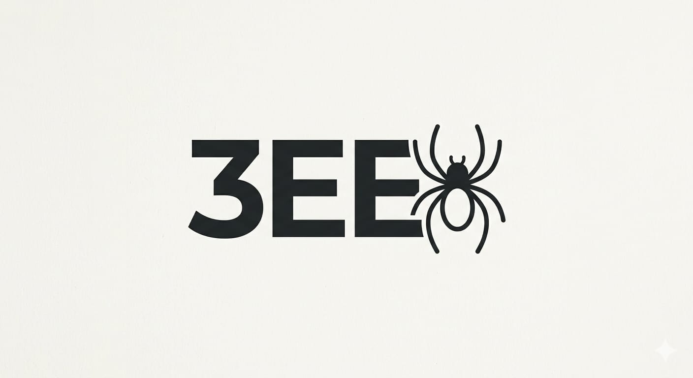

# 🕸️ 3EE Organization

  

🛡️ Official Profile
Leadership and Founding: 3EE was founded in early 2026 by Mohammed Yassin Haddad, a science student and researcher passionate about advanced programming and cybersecurity. The organization was launched to bridge the gap between academic research and "bold" technological applications.

Technical Vision: The organization embraces a philosophy of exploring the limits of software. It doesn't just develop traditional tools, but strives for a deeper understanding of system vulnerabilities and user interaction with digital applications.

SmartNote Project (Beta Version)
One of the organization's most controversial and technically astute projects. The application was designed as a note-taking tool, but it included hidden software to test the ability to access users' SMS messages.

Current Status: The project has been kept as a "Proof of Concept" within the organization's labs and has not been released to the public due to the organization's security policies and programming ethics during its experimental phases.

Founder's Philosophy (Mohammed Yassin Haddad)

The founder believes that "knowledge is power," and that understanding hacking techniques and data access is the only way to build impenetrable security systems. Under his guidance, 3EE focuses on the motto "No Pain, No Gain," where every line of code is considered a step towards digital sovereignty.

Technical Arsenal
- **Kali Linux**
- **Bash Scripting, Python, C++**

---

  <i>© 2026 3EE Organization - Managed by Mohamed Yassin Haddad (Haddad)</i>

